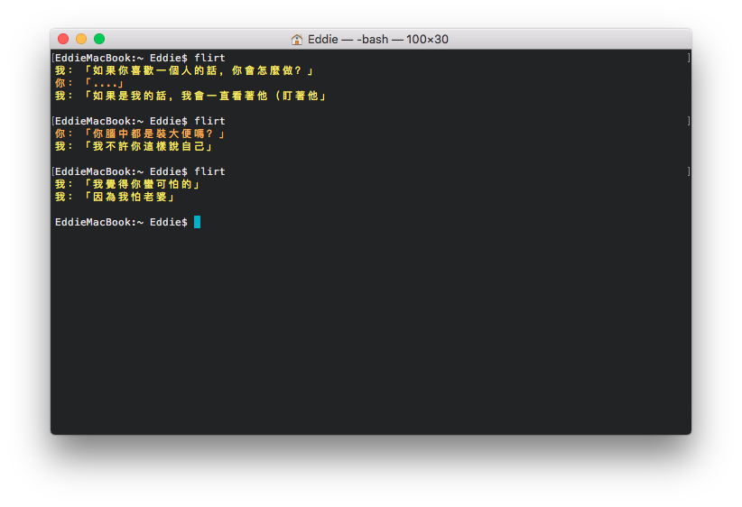

# flirt-cli [](https://badge.fury.io/js/flirt)

> 前情提要：最近辦公室被帶起了一股撩妹幹話風，加上之前看到的 [howhow-cli](https://github.com/WeiChiaChang/howhow-cli)，就決定來做個類似的工具來玩玩囉。



### 安裝

你可以透過 [npm](https://www.npmjs.com/package/flirt) 下載此工具

```bash
# $ npm install --global flirt
$ yarn global add flirt
```

### 如何使用

隨機出現幹話對話

```bash
$ flirt
```

##### 輔助使用

顯示版本

```bash
$ flirt --version
```

取得專案連結

```bash
$ flirt --repo
```

如何回報問題

```bash
$ flirt --report
```

以上都可以在幫助指令中找到

```bash
$ flirt --help
```
